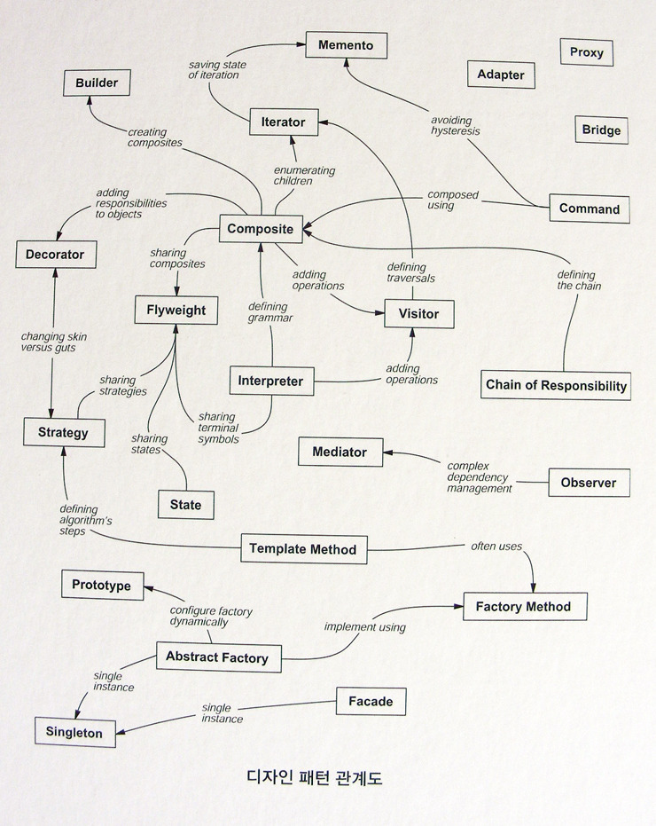

# 패턴에 대해 알아보자

 디자인 패턴 관계도  

# 생성, 행동, 구조 관련 패턴으로 분류

## 생성 관련 패턴 (Creational Pattern) : 객체 인스턴스 생성을 위한 패턴으로, 클라이언트와 그 클라이언트에서 생성해야 할 객체 인스턴스 사이의 연결을 끊어주는 패턴

싱글턴, 팩토리 메소드, 추상 팩토리, 프로토타입, 빌더 패턴

## 행동 관련 패턴 (Behavioral Pattern) : 클래스와 객체들이 상호작용하는 방법 및 역할을 분담하는 방법과 관련된 패턴

스트래티지, 옵저버, 스테이트, 커맨드, 이터레이터, 템플릿 메소드, 인터프리터, 미디에이터, 역할 변경, 메멘토, 비지터

## 구조 관련 패턴 (Structural Pattern) : 클래스 및 객체들을 구성을 통해서 더 큰 구조로 만들 수 있게 해 주는 것과 관련된 패턴

데코레이터, 어댑터, 컴포지트, 퍼사드, 프록시, 브리지, 플라이웨이트

# 패턴?

- 소프트웨어 디자인에 있어 반복해서 발생하는 문제에 적용 가능하며, 재사용 가능한 솔루션

# Q. 패턴이 필요한 이유

1.  패턴은 검증된 솔루션
2.  쉽게 재사용 가능
3.  좋은 표현수단

# Q. 이점

1.  작은 이슈들을 예방
    - 코드의 구조에 대한 시간 단축, 솔루션에 대한 전반적인 품질에 더 많은 시간 할애
2.  일반화된 해결책을 제공
    특정 문제에 얽매이지 않는 방식으로 문서화 가능
3.  코드 파일 크기를 축약

- 반복 부분을 줄이고 전체 분량을 줄일 수 있음.

4.  지속적 개선

- 자주 사용하는 패턴은 지속적인 업데이트를 통해 개선되어 신뢰도가 높음

# 참고

1.  http://devbox.tistory.com/entry/DesignPattern-디자인-패턴의-분류 [장인개발자를 꿈꾸는 :: 기록하는 공간]
2.  https://opentutorials.org/module/139/
3.  https://joshua1988.github.io/web-development/javascript/javascript-pattern-design/
4.  https://imcts.github.io/javascript-pattern/ #팩토리 패턴
5.  https://github.com/yoosoo-won/yoosoo-won.github.io/wiki/%EB%94%94%EC%9E%90%EC%9D%B8-%ED%8C%A8%ED%84%B4
6.  http://webclub.tistory.com/311
7.  https://www.youtube.com/watch?v=A8vlmCVn-zs
